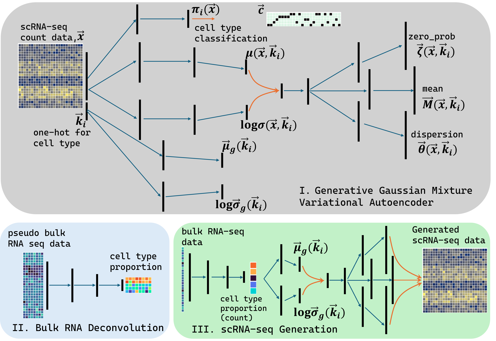
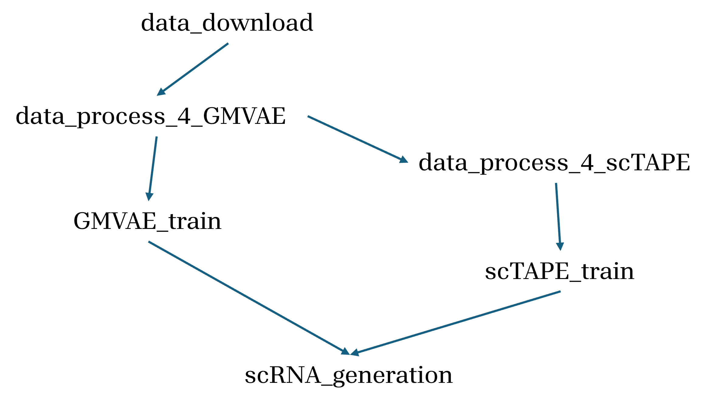

# bulk2sc_GMVAE
### Fig.1 Model schematic diagram

The `bulk2sc` model is a machine learning tool based on a Gaussian mixed variational autoencoder (GMVAE) that generates single-cell RNA sequencing (scRNA-seq) data from bulk RNA sequencing (bulk RNA-seq) data. This repository demonstrates the operation of `bulk2sc` using the scRNA-seq dataset [GSE130148](https://www.ncbi.nlm.nih.gov/geo/query/acc.cgi?acc=GSE130148).

* I. scRNA Gaussian mixture variational autoencoder, which learns the patterns in scRNA-seq data in cell types and learn how to generate scRNA-seq data.
* II. bulk RNA-seq deconvolution, which predicts cell type proportions from bulk RNA-seq. [`scTAPE`](https://sctape.readthedocs.io/) is adopted.
* III. scRNA-seq generator, which is a combination of components in I and II and generates scRNA-seq data from bulk RNA-seq data.

The GMVAE model (Part I in Fig. 1) requires a scRNA-seq raw count table in Matrix Market exchange format (MTX file) along with the corresponding cluster (cell type) data in a CSV file. [`scTAPE`](https://sctape.readthedocs.io/)(Part II in Fig. 1) utilizes the scRNA-seq raw count table as a dense matrix, with the cluster data as the row index. Additionally, TPM-normalized bulk data is needed to accompany the single-cell data.

### Fig.2 Procedures and operation order

