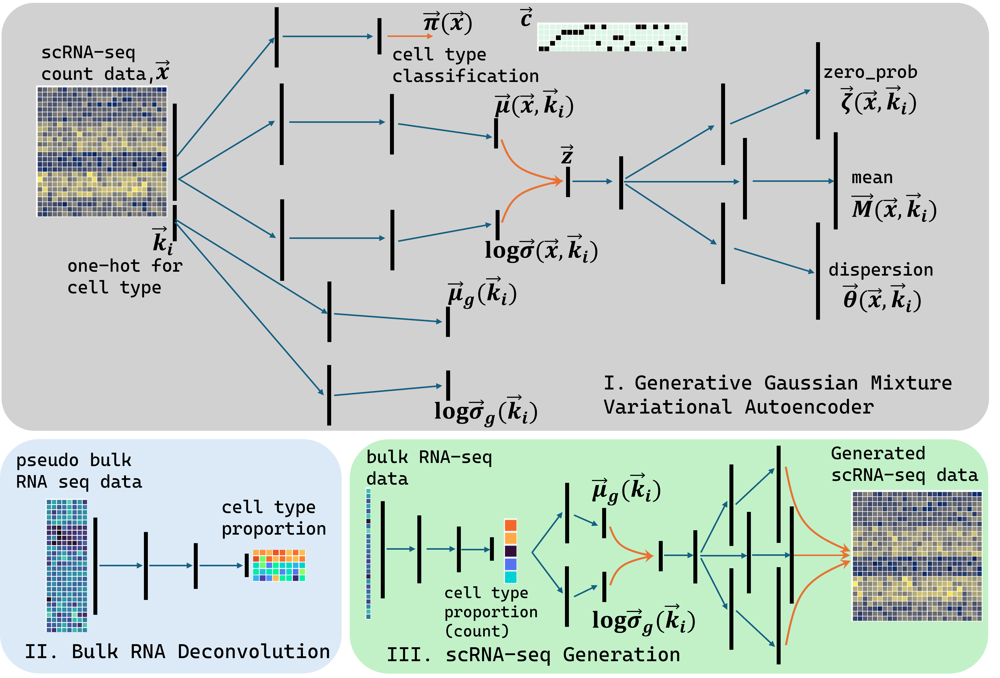
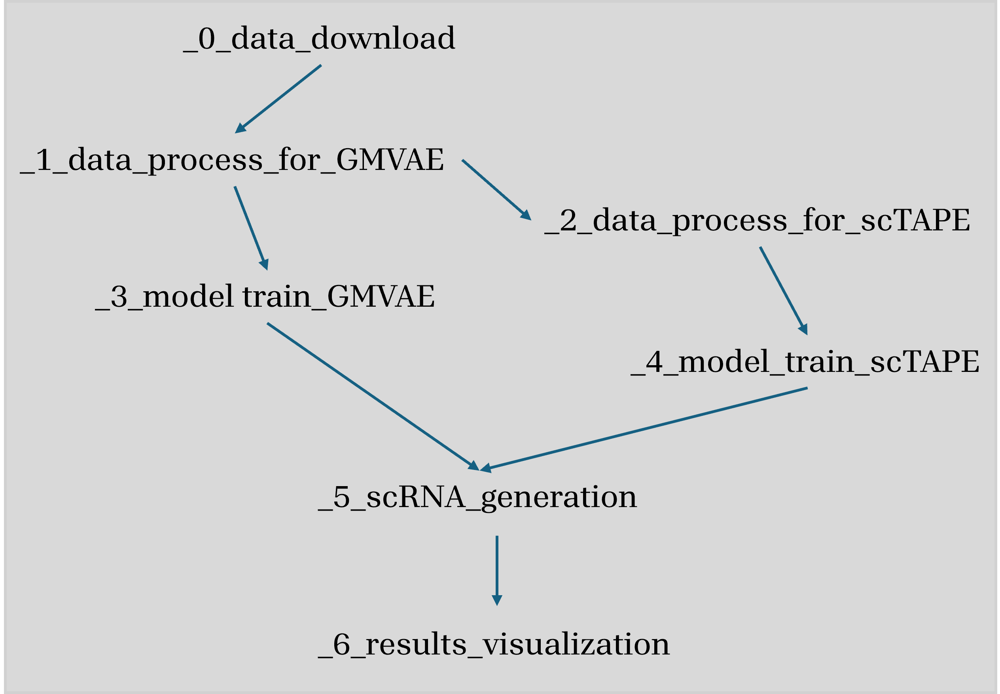
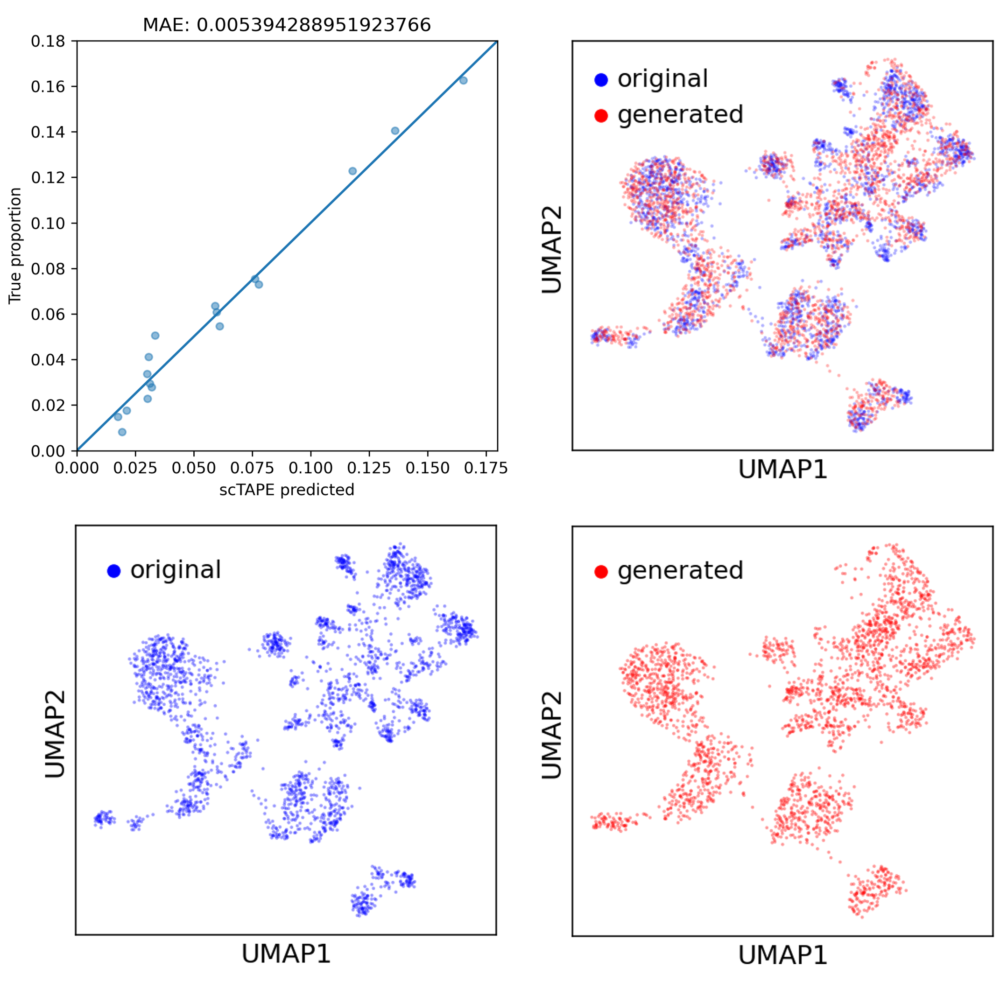
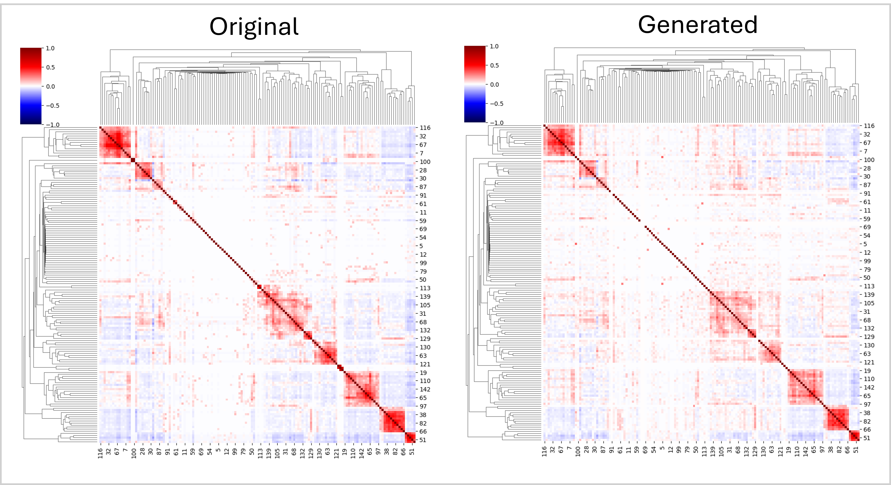

# bulk2sc_GMVAE

#### Fig.1 Model schematic diagram

The `bulk2sc` model is a machine learning tool based on a Gaussian mixture variational autoencoder (GMVAE) that generates single-cell RNA sequencing (scRNA-seq) data from bulk RNA sequencing (bulk RNA-seq) data. The purpose of this repository is to demonstrate the operation of `bulk2sc` and to reproduce the results published in **here** for the scRNA-seq dataset [GSE130148](https://www.ncbi.nlm.nih.gov/geo/query/acc.cgi?acc=GSE130148).

The `bulk2sc` model is made up of three main components (Fig. 1):
* I. scRNA Gaussian Mixture Variational Autoencoder (GMVAE) – Learns patterns in scRNA-seq data across different cell types and generates synthetic scRNA-seq data.
* II. Bulk RNA-seq Deconvolution – Predicts cell type proportions from bulk RNA-seq data using the training from scTAPE-seq data. The [`scTAPE`](https://sctape.readthedocs.io/) is adopted.
* III. scRNA-seq Generator – Integrates components I and II to generate scRNA-seq data from bulk RNA-seq input.

#### Fig.2 Procedures and operation order
The GMVAE model (Part I in Fig. 1) requires a scRNA-seq raw count table in Matrix Market exchange format (MTX file) along with the corresponding cluster (cell type) data in a CSV file. The `scTAPE`(Part II in Fig. 1) utilizes the scRNA-seq raw count table as a dense matrix, with the cluster data as the row index. The column names are gene names. Additionally, TPM-normalized bulk data is needed to accompany the single-cell data.
Running scripts in `_0_` and `_1_` will prepare all necessary data for GMVAE training. The downloaded data will be split into a train data set and a test data set in separate folders for the GMVAE training. Running the scripts `_2_` will prepare the data for `scTAPE` training. The raw scRNA-seq training data is converted into a dense matrix format, and several pseudo-bulk RNA-seq datasets are generated by randomly sampling from the test data and applying TPM normalization. Scripts in `_3_` and `_4_` are used to train GMVAE and `scTAPE`, respectively, producing `.pt` files that contain the saved models. Those saved models are used in `_5_` to generate scRNA-seq data. 
Given a TPM-normalized bulk RNA-seq dataset, script `_5_` generates synthetic scRNA-seq data for any desired cell count. For comparison, the script also accepts scRNA-seq data, computes pseudo-bulk data, and returns a synthetic scRNA-seq dataset with a matching total number of cells.

#### Fig.3 scTAPE predicted vs true proportion. UMAPs of original test data vs generated data using predicted proportion.

Write something here.

#### Fig.4 Gene correlation in original data vs generated data.
