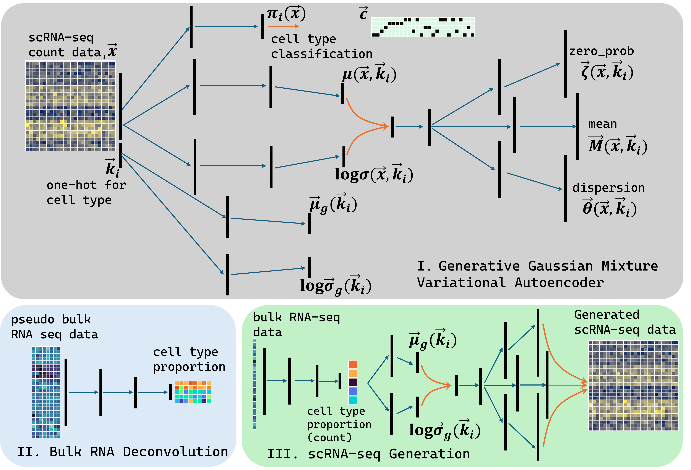

# bulk2sc_GMVAE
bulk2sc is a machine learning model based on a Gaussian mixed variational autoencoder that generates scRNA-seq data from bulk RNA-seq data. 
This repository aims to demonstrate bulk2sc operation using scRNA-seq data GEO182302.

