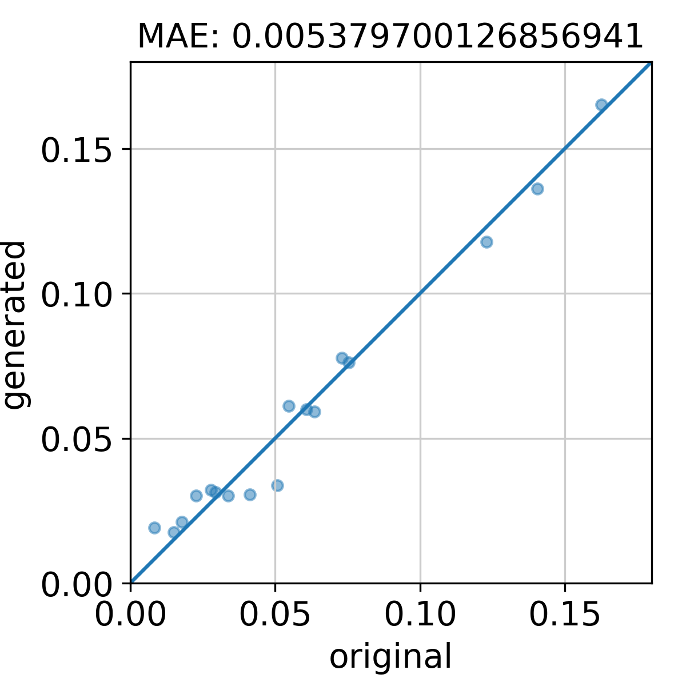
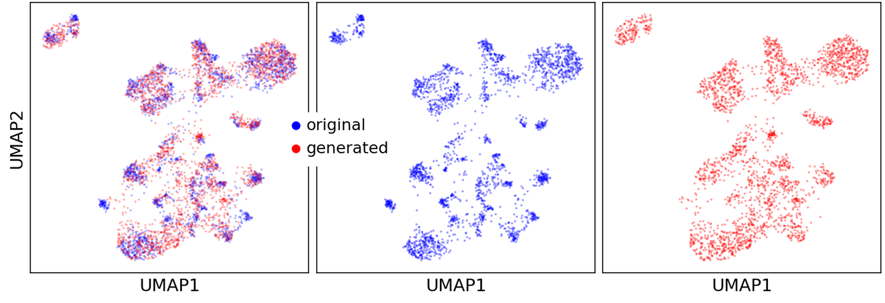
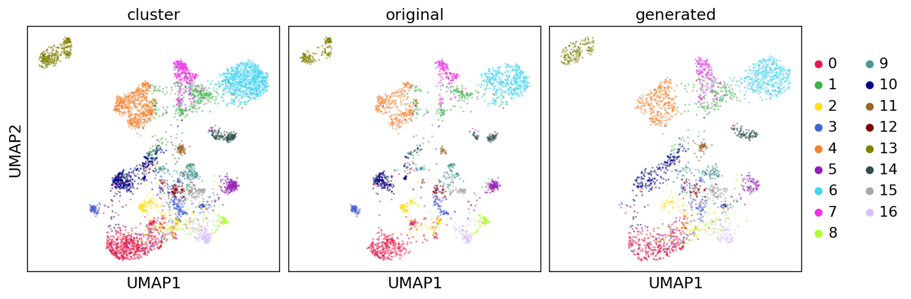

## Proportion comparison
The `scTAPE` predicted cell type proportions and the ground truth proportions (if available) are compared via scatter plot. 
```
from visualize_results import *
cluster_file1="../_1_data_process_for_GMVAE/test/cluster_lung_test.csv" #ground truth cell typeproportion
cluster_file2="../_5_scRNA_generation/cluster_generated_using_test_data.csv" #predicted cell type proportion

plot_proportions('original', cluster_file1, 'generated', cluster_file2)
```
Running the above script will produce a scatter plot like this.



## UMAPs for dataset & cluster
```
from visualize_results import *
# data 1
count_file1="../_1_data_process_for_GMVAE/test/matrix_lung_test.mtx"
genename_file1="../_1_data_process_for_GMVAE/test/genes_lung_test.tsv"
cluster_file1="../_1_data_process_for_GMVAE/test/cluster_lung_test.csv"
# data 2
count_file2="../_5_scRNA_generation/matrix_generated_using_test_data.mtx"
genename_file2="../_1_data_process_for_GMVAE/test/genes_lung_test.tsv" #same as data 1
cluster_file2="../_5_scRNA_generation/cluster_generated_using_test_data.csv"

plot_umaps('original', count_file1, genename_file1, cluster_file1, 
           'generated', count_file2, genename_file2, cluster_file2)
```




