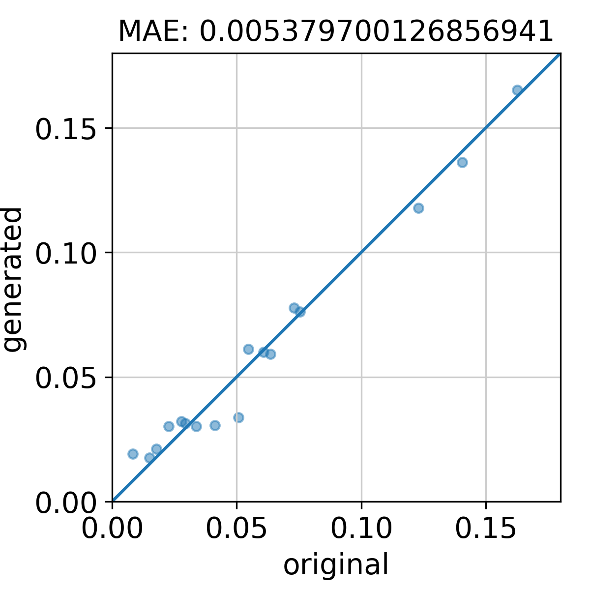

# Quick demo
The script and data files in this directory will demonstrate how the trained models can generate scRNA-seq data from bulk RNA-seq data. 

The `data_for_quick_demo` directory contains all the necessary data and model files for the demonstration. The file `lung_GMVAE_wholePTmodel.pt` is the trained GMVAE model and the file `model_scTAPE_lung.pt` is the trained `scTAPE` model--both trained on lung train data. The file `bulk_data_to_test.txt` is a pseudo bulk RNA-seq data aggregated from lung test data. It is unseen by the models, but it comes with the ground truth cell type proportions. The `scTAPE` model will first process this pseudo bulk RNA-seq data to predict cell type proportions, which will then be compared to the ground truth values. Then, the trained GMVAE model will generate scRNA-seq data with cell counts matching the predicted proportions.
```python
from scTAPE_predictor_by_modelpt import *

modelpt="./data_for_quick_demo/model_scTAPE_lung.pt"   #scTAPE model
geneleng='./data_for_quick_demo/GeneLength.txt'        #gene length for tpm normalization 
rna_file='./data_for_quick_demo/bulk_data_to_test.txt' # bulk RNA-seq data. one-row data with gene names as column names.
                                                       # It must be raw count data.
intersect_list='./data_for_quick_demo/genename_lung.csv'  # gene list that was used in scTAPE training.

pred_prop, _ = predicted_proportion_by_TAPE_model(modelfile=modelpt, 
                                   genelenfile=geneleng, 
                                   intersect_gene=intersect_list, 
                                   rna_data=rna_file)
```
Printing `pred_pror` would display proportions like
```python
[0.1361472  0.07620474 0.03358484 0.06110592 0.11792746 0.03078262  0.165271   0.05988612 0.03028877 0.03015646 0.07783207 0.01938615  0.01753762 0.05920918 0.03208745 0.02136544 0.03122693].
```
Now, let's generate a total of 2548 cells following these proportions.
```python
from GMVAE_generate_by_modelpt import *
total_count=2548                                        # total cell count
cell_counts = [round(x) for x in pred_prop*total_count] # break down to each cell type

modelfile="./data_for_quick_demo/lung_GMVAE_wholePTmodel.pt" # GMVAE model
generate_from_pt_cellcounts(modelfile, cell_counts, suffix="lung_generated")
```
The last command will save two files: a raw scRNA-seq count matrix file (`matrix_lung_generated.mtx`) and a cell type information file (`cluster_lung_generated.csv`).

Let's compare the ground truth proportion and the predicted proportion.
```python
from visualize_results import *
cluster_file1="./data_for_quick_demo/cluster_lung_test.csv"  # cell type data just generated
cluster_file2="./cluster_lung_generated.csv"                 # ground truth cell type data

plot_proportions('original', cluster_file1, 'generated', cluster_file2)
```


